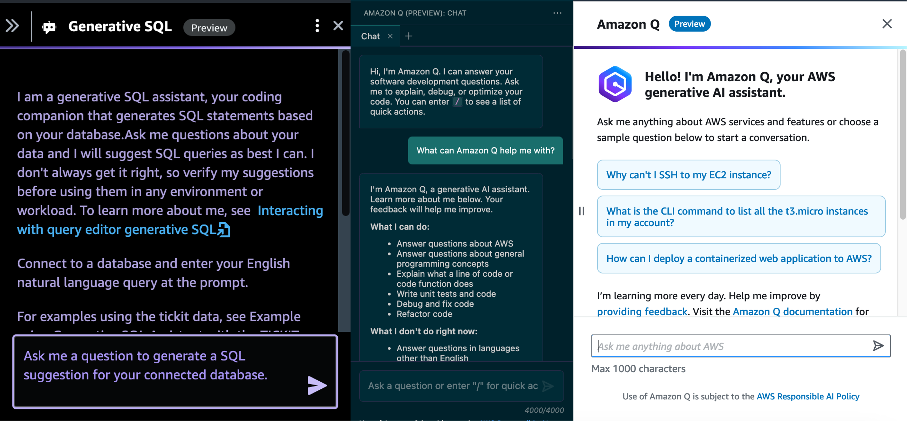

# Next Generation Developer Experience with Amazon Q and Amazon CodeWhisperer

Welcome to the next generation of developer experience workshop, where we explore how to build applications assisted with generative AI tools Amazon Q and Amazon CodeWhisperer. This workshop is designed to teach you how to effectively utilize these tools to assist in coding, debugging, and enhancing your data analytics capabilities. Additionally, you'll learn to create a personalized Amazon Q assistant that can chat with documents.

In this workshop you will complete the following 4 modules:

1. Write code with Amazon CodeWhisperer: Learn how CodeWhisperer can streamline your code writing process. This module shows practical ways to improve and speed up coding using generative AI.

2. Debug Lambda Functions Using Amazon Q: Learn how to use Amazon Q to efficiently debug a Lambda function, demonstrating the practical applications of generative AI for troubleshooting.

3. Generating SQL Queries in Redshift with Amazon Q: Learn how Amazon Q aids in creating effective SQL queries for Redshift. You will get hands-on experience in using Q to extract insights from a dataset.

4. Build a Customized Amazon Q to chat with doucments: Finally, you will build your own custom Amazon Q assistant to chat with S3 documents.

This is a 300 level workshop, so some familiarly with using services such as AWS Lambda and writing Python code is helpful. No AI/ML experience is necessary. This workshop is intended to be finished within 2 hours.

Here is the link to the [workshop](https://catalog.workshops.aws/next-gen-dev-data-analysis-with-q/en-US)

## Security

See [CONTRIBUTING](CONTRIBUTING.md#security-issue-notifications) for more information.

## License

This library is licensed under the MIT-0 License. See the LICENSE file.

